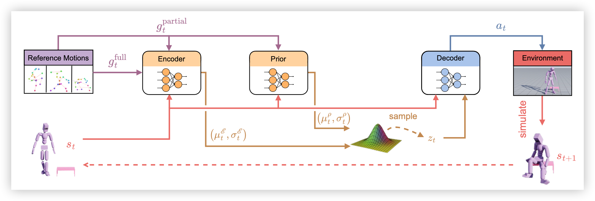

  v1.3

# MaskedMimicPlus 

一个统一的端到端人形全身（**全身包括灵巧手共153个自由度**）动作控制框架，覆盖从模仿跟踪到目标导向操控的多种任务形式。

当前已完成：
✔ 全身动作模仿

正在调试：
- 稀疏约束下的远程遥操
- 自主执行自定义任务

---

## 一、效果展示

#### 全身动作模仿

模仿人类走到桌边并抓起桌面上的物体。

  <video controls width="256" autoplay muted loop playsinline>
    <source src="assets/demo/s10-smplx_retargeted-airplane_fly_1_0_595.mp4" type="video/mp4" />
    您的浏览器不支持 video 标签。
  </video>
  <video controls width="256" autoplay muted loop playsinline>
    <source src="assets/demo/s10-smplx_retargeted-cubemedium_inspect_1_0_497.mp4" type="video/mp4" />
    您的浏览器不支持 video 标签。
  </video>
  <video controls width="256" autoplay muted loop playsinline>
    <source src="assets/demo/s10-smplx_retargeted-apple_eat_1_0_619.mp4" type="video/mp4" />
    您的浏览器不支持 video 标签。
  </video>

  <video controls width="256" autoplay muted loop playsinline>
    <source src="assets/demo/s10-smplx_retargeted-banana_eat_1_0_1450.mp4" type="video/mp4" />
    您的浏览器不支持 video 标签。
  </video>
  <video controls width="256" autoplay muted loop playsinline>
    <source src="assets/demo/s10-smplx_retargeted-camera_browse_1_0_956.mp4" type="video/mp4" />
    您的浏览器不支持 video 标签。
  </video>
  <video controls width="256" autoplay muted loop playsinline>
    <source src="assets/demo/s10-smplx_retargeted-alarmclock_pass_1_0_396.mp4" type="video/mp4" />
    您的浏览器不支持 video 标签。
  </video>

##### 物品抓取成功率统计

| 抓取类型 | 物体类型                 | 物体举例                                 | 成功率 | 主要失败原因                                           |
| -------- | ------------------------ | ---------------------------------------- | ------ | ------------------------------------------------------ |
| 单手     | 常规形状物体             | 闹钟、苹果、香蕉、鼠标、相机、大象模型等 | 99%    | -                                                      |
| 单手     | 细长的物体或者扁平的物体 | 高脚杯、水果刀、牙刷、眼镜等             | 11%    | 容易抓错位置                                           |
| 单手     | 有孔洞把手的物体         | 杯子的把手、剪刀等                       | 2%     | 容易把物体撞翻、手指无法穿过孔洞把手                   |
| 单手     | 大型物体                 | 大立方体、大球体等                       | 32%    | 容易抓不稳而滑落                                       |
| 双手     | 各类物体                 | 各类物体                                 | 13%    | 双手配合难度大，模型退化成保守模式（只接触不用力举起） |

##### 部分抓取失败案例展示

双手配合难度大，模型退化成保守模式（只接触不用力举起）

  <video controls width="200" autoplay muted loop playsinline>
    <source src="assets/demo/failure_case/s10-smplx_retargeted-bowl_drink_1_Retake_0_1025.mp4" type="video/mp4" />
    您的浏览器不支持 video 标签。
  </video>

物体太大，用力不合适导致抓取滑落

  <video controls width="200" autoplay muted loop playsinline>
    <source src="assets/demo/failure_case/s10-smplx_retargeted-cubelarge_inspect_1_0_837.mp4" type="video/mp4" />
    您的浏览器不支持 video 标签。
  </video>

#### 稀疏约束下的远程遥操

正在调试中

#### 自主执行自定义任务

正在调试中

---

## 二、概述

### 1.1 系统架构

### 1.1 特点

与传统使用物理引导、逆运动学或手工设计控制器的管线不同，本项目强调：

#### 1. 端到端控制（End-to-End Control）

- 输入：观察到的身体部分关节位姿、物体状态、以及可选的目标任务信息；

- 输出：每个关节的力/速度/目标位姿等控制量；

策略可以通过强化学习直接优化控制输出，因此整个策略：

- 不依赖 IK解算；

- 不需要传统硬编码模块化分解；

- 控制规律由模型自动学习得到，支持更复杂的全身动作协调；

#### 2. 基于 VAE 的动作风格潜变量（Natural Motion Latent）

项目采用 VAE（Variational Autoencoder）结构来学习人体自然动作风格：

- 编码器将复杂的全身动作压缩为一个低维隐变量；

- 隐变量代表动作风格、惯性、身体配合关系；

- 解码器根据隐变量生成物理一致的动作；

优点：

- 可以在稀疏约束下对多种可能的动作分布进行建模，从而避免出现模式平均问题；
- 解耦了高层控制策略和低层动作控制，可以快速微调适配新任务；

#### 3. 稀疏控制能力：只指定部分关节，其余由神经网络自适应补全

在远程控制（teleoperation）或 VR 输入中，常见情况是：

- 只有 头部和双手的位姿；

- 或者只是给定“物体目标位置”；

- 或者部分关节被跟踪，其余要自动补全；

本项目支持：

✔ 只指定部分关节（例如：头 + 双手），其余身体动作由策略自适应生成

这是端到端 + VAE 结构的联合优势，使得系统可以：

- 在 VR 中生成完整的人形动作；

- 自动调节躯干、腿部、重心、平衡；

- 适应不同体型的角色；

- 在抓取物体时自动做姿态协调；

- 自主执行自定义任务；

也非常适合未来扩展为遥操作机械人或全身 teleoperation。

### 1.2 与相关工作的关系

本项目基于 MaskedMimic 的开源代码进行扩展开发，将其能力从“纯全身模仿（AMASS）”拓展至“人—物交互模仿（GRAB）”。

原始 MaskedMimic 仅支持 AMASS 数据集的无物体全身动作模仿，不包含手部接触和抓取相关能力。

在此基础上，本项目完成了以下系统级扩展：

- 构建 GRAB 数据的人形重定向与物体对齐流程；
- 重新设计奖励结构以支持抓取接触与物体状态约束；
- 修改训练管线以支持人—物交互的物理建模；

最终实现了在物理仿真环境中模仿 GRAB 数据中人类抓取动作的能力。

本项目的研究方向与 NVIDIA 后续提出的 MaskedManipulator 存在一定重叠，但其实现代码尚未开源，本项目的扩展与实现均独立完成。

#### **相似方向**

- 都以端到端物理控制为核心;
- 都关注人—物交互场景下的模仿与控制问题;
- 都继承自 MaskedMimic 的端到端模仿框架;

#### **不同点**

- **奖励函数结构更轻量，计算量显著减少**： MaskedManipulator 使用较复杂的表面点几何约束（例如最近点方向一致性），需要实时计算大量指尖/物体表面距离。本项目完全不需要这类几何约束，以更简洁的接触/姿态目标奖励，因此**计算量显著减少**，训练更高效；

- **无需修复GRAB中物体位姿：** 直接在重定向过程中适配不同体型带来的手-物品相对位姿误差，显著减少了重定向模块复杂度和耗时；

---

## 三、后续工作
### 1. 稀疏约束下的远程遥操
目前VAE架构下已具备稀疏关节约束下的远程遥操，但是模型还需要进一步微调训练和调通遥操部分pipeline。

### 2. 自主执行自定义任务
增加路径规划逻辑和物品摆放位置的自定义接口，让机器人可以执行类似于工业流水线中的自定义任务。

## 四、相关参考
1. MaskedMimic- Unified Physics-Based Character Control Through Masked Motion Inpainting
2. PULSE -UNIVERSAL HUMANOID MOTION REPRESENTATIONS FOR PHYSICS-BASED CONTROL
